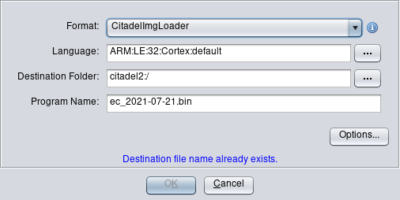

# Ghidra loader for Titan M firmwares

This is a simple module for Ghidra allowing to load firmwares for Titan M (a.k.a Citadel).



## Build

```bash
$ export GHIDRA_INSTALL_DIR=<Path to Ghidra dir>
$ gradle
$ cp dist/<last_build>.zip $GHIDRA_INSTALL_DIR/Extensions/Ghidra/
$ # enable new extensions in Files -> Install Extensions... then restart Ghidra
```

